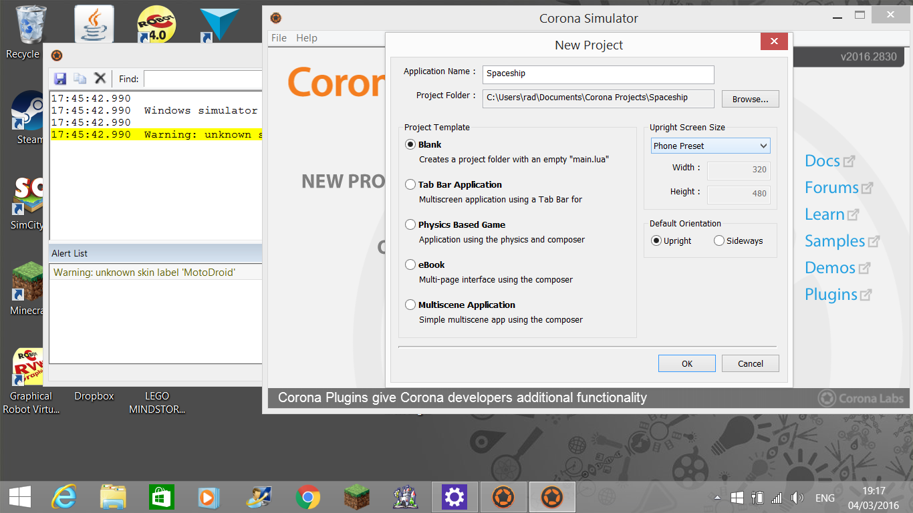

# Introduction to Mobile Programming with Corona SDK
-

### Discuss

Look at the following built-in Android applications:

- Messaging
- Clock
- Calendar

Based on what you know from programming desktop applications, how will you build these three applications?

What are the common characteristics of these three mobile applications?

_1. They present information to the user_

_2. They respond to input from the user_

_3. (Optional) They send or receive information through the device network_

_4. (Optional) They access the device sensors - camera, microphone, accelerometer, gyroscope, etc._

### What we will cover

In this workshop, we'll build a very simple game that incorporates the most common characteristics of mobile applications: (1) Present information to the user, and (2) Respond to input from the user.

The game lets the user control a spacehip by pressing a left button, a right button, and a fire button. Pressing the left button makes the spaceship go left, pressing the right button makes the spaceship go right, and pressing the fire button makes the spaceship fire bullets. The game ends when the player fires a bullet that hits the target.

### Step 1. Install Corona SDK

Go to https://coronalabs.com/

Create an account and login. After logging in, go back to https://coronalabs.com/.

Click the Download button. As of this writing, the public release version is 2016.2830.

Launch the installer and follow the instructions to install Corona SDK.

### Step 2. Create a new, empty Corona project

Run Corona Simulator

Create a new, empty project in `C:\Users\USERNAME\Documents\Corona Projects\Spaceship`



Open the project in your editor

Edit `main.lua` and add this line to the bottom:

```
print "Hello, World!"
```

Save the file.

The Corona Simulator will detect the save operation and will ask you if you want to relaunch the Simulator (reload the project) every time there are changes. Check `Remember my preference` and click the `Relaunch Simulator` button.

Open the `Corona Simulator Output` window. You should see a timestamp and the text `Hello, World!`

### Step 3. Draw the spaceship

Copy the file `spaceship.png` to `C:\Users\USERNAME\Documents\Corona Projects\Spaceship`

Edit `main.lua`

Remove the line `print "Hello, World!"`

Add

```
-- Draw the spacehip
startX = display.viewableContentWidth / 2
startY = display.viewableContentHeight - 100
spaceship = display.newImage( "spaceship.png", startX, startY )
```

The line `-- Draw the spacehip` is a comment. Feel free to sprinkle code sections with comments to make them more understandable.

Try changing the `startX` and `startY` values to change the placement of the spaceship.

Note: The Corona coordinate system has 0,0 at the top-left corner of the screen. You can read more about it in the [Corona Graphis Documentation](https://docs.coronalabs.com/guide/graphics/group.html#coordinates)

### Step 4. Draw the user interface - the left, right, and fire buttons

Copy the files `button-left.png`, `button-right.png` and `button-fire.png` to `C:\Users\USERNAME\Documents\Corona Projects\Spaceship`

Draw the buttons on the screen. You've seen how to draw an image in the previous step. Add the code after the spaceship-drawing code.

Here's my code:

```
-- Draw the UI controls
buttonY = display.viewableContentHeight
leftButtonX = (display.viewableContentWidth/2) - 100
fireButtonX = (display.viewableContentWidth/2)
rightButtonX = (display.viewableContentWidth/2) + 100
leftButton = display.newImage( "button-left.png", leftButtonX, buttonY )
fireButton = display.newImage( "button-fire.png", fireButtonX, buttonY )
rightButton = display.newImage( "button-right.png", rightButtonX, buttonY )
```

### Step 5. Detect when the user tapped the buttons

Add placeholder event functions:

```
-- Define the button event handlers
local function onLeftButtonTap ( event )
  print( "Left button was tapped!" )
  return true
end

local function onRightButtonTap ( event )
  print( "Right button was tapped!" )
  return true
end

local function onFireButtonTap ( event )
  print( "Fire button was tapped!" )
  return true
end
```

And then attach the event functions to the buttons:

```
-- Attach event handlers to the buttons
leftButton:addEventListener( "tap", onLeftButtonTap )
rightButton:addEventListener( "tap", onRightButtonTap )
fireButton:addEventListener( "tap", onFireButtonTap )
```

Run the code on the simulator. Tap the buttons and observe the simulator logs.

Corona guides:

[Events](https://docs.coronalabs.com/daily/guide/events/detectEvents/index.html)

[Tap/Touch/Multitouch](https://docs.coronalabs.com/daily/guide/events/touchMultitouch/index.html)

### Step 6. Build the app into the device

Enable developer mode on your Android device

On Corona Simulator, go to File -> Build -> Android

Click Build. Corona Simulator will create an .apk for you. By default it'll be in `C:\Users\USERNAME\Documents\Corona Built Apps`

Connect your Android device to the computer and transfer the .apk file to the device.

Use File Manager or a similar app to launch the .apk installer.

Easier way, if you have the Android SDK installed on your computer:

`adb install -r your-app.apk`

Corona guide:

[Device installation](https://docs.coronalabs.com/daily/guide/distribution/androidBuild/index.html#installapp)

### Step 7. Make the spaceship move when the left or right button is tapped

We already added button event handlers in the previous step:

```
local function onLeftButtonTap ( event )
  print( "Left button was tapped!" )
  return true
end
```

We just need to modify them to actually move the spaceship. To do this we'll use [Corona's built-in physics engine] (https://docs.coronalabs.com/daily/api/library/physics/index.html).

At the start of the program, initialize the physics engine and set a zero gravity:

```
local physics = require "physics"
physics.start()
physics.setGravity( 0, 0 )
```

We need to add the spaceship to the physics engine. We'll do that after drawing the spaceship on the screen. Modify our spaceship code block to:

```
-- Draw the spacehip
startX = display.viewableContentWidth / 2
startY = display.viewableContentHeight - 100
spaceship = display.newImage( "spaceship.png", startX, startY )
physics.addBody( spaceship )
```

Change the `onLeftButtonTap` function to:

```
local function onLeftButtonTap ( event )
  spaceship:applyForce( -1, 0, spaceship.x, spaceship.y )
  return true
end
```

Likeweise change the `onRightButtonTap` function:

```
local function onLeftButtonTap ( event )
  spaceship:applyForce( 1, 0, spaceship.x, spaceship.y )
  return true
end
```

Run the program in the simulator. If you tap the left button you'll see the spaceship move left until it moves off the edge. Tap the right button to make it stop, and tap it again to make it move back to the right.

#### Exercise

We do not yet do anything to ensure the spaceship stays on the screen. What's a simple way to do this Using the physics engine?

### Step 8. Make the spaceship fire bullets when the fire button is tapped

Time to shoot some bullets!

To keep things simple, we'll have only one bullet at a time. To enforce this, we'll only fire a bullet if there is no active bullet on the screen.

#### Exercise

Declare a `bullet_active` variable and initialize it to `0` (false)

Draw a bullet but set the x and y coordinates such that the bullet is off the screen

Add the bullet to the physics world

When the player taps the fire button, if there is no active bullet, do the following:

- move the bullet to the upper edge of the spaceship by changing it's x and y properties
- apply a force to the bullet to make it go up

### Step 11. End the game when a bullet hits the target

#### Exercise

Get your friend's Facebook profile picture and save it as a PNG file named "target.png"

Add target.png to the project

Draw target.png at the upper edge of the screen. Add it to the physics world so that we can know when a bullet hits it.

When a bullet hits the target image, make it bigger (scale up) and then smaller (scale down) three times

You'll find these guides useful:

[Corona collision detection](https://docs.coronalabs.com/daily/guide/physics/collisionDetection/index.html)

[Corona transitions](https://docs.coronalabs.com/api/library/transition/to.html)

### Wrap-up
